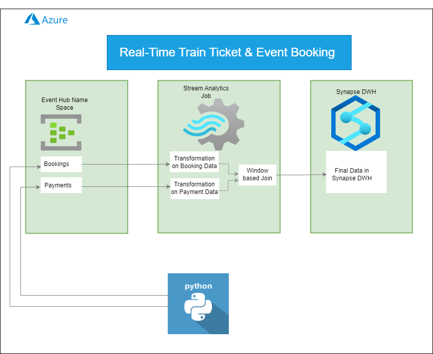

### **End To End Data Engineering Pipeline: Real-Time Stream Processing with Azure Event Hub**

In this project, an Azure Event Hub namespace is created to handle real-time data streams. Within the Event Hub namespace, two Event Hubs (similar to topics in message brokers) are set up, named **"bookings"** and **"payments"**, to receive continuous streams of data.
### **Architecture**

The objective is to listen to these two data streams and perform real-time join operations using a **tumbling window**, enabling the correlation of booking and payment data as it is generated. After the join operation, the resulting data is then inserted into **Azure Synapse Analytics** for storage and further analysis.

The main tasks of the project are as follows:

1. **Publish Mock Data**: Simulate and publish mock data from the python scripts to the **bookings** and **payments** Event Hubs.
2. **Real-Time Data Transformation and Join Operations**: Use an **Azure Stream Analytics Job** to listen to both streams, apply real-time data transformation, and perform window-based join operations using a **tumbling window**.
3. **Query and Data Insertion**: Write the necessary query to implement the transformations and join operations, and then insert the final joined data into a **Synapse Analytics** table for storage and analysis.

### **Technology Used**

1. Programming Language - Python  
2. Scripting Language - SQL 
3. Azure Cloud Platform
    - Azure Stream Analytics
    - Azure Eventhub
    - Azure Synapse Ayalytics

### **Dataset Generation Using Faker Library**

In this project, mock data for both **Bookings** and **Payments** is generated using the **Faker** library. The generated data is then published to two separate Azure Event Hubs: **"bookingstopic"** and **"paymentstopic"**.

- **Payments Data**: Simulates payment events, including details like payment IDs, order IDs, payment time, amount, payment method, and payment status. This data is continuously sent to the **paymentstopic** Event Hub.
  
- **Bookings Data**: Simulates booking events, including order IDs, booking time, customer information (ID, name, email), and event details such as event name, location, and seat information. This data is continuously sent to the **bookingstopic** Event Hub.

Both scripts use the **Azure Event Hub SDK** to send the generated mock data to the respective Event Hubs. The **Faker** library helps generate realistic data, simulating a real-world scenario with random values for names, emails, event details, and timestamps.

This setup provides a continuous feed of real-time data for testing the subsequent stream processing and analytics tasks.

### **Scripts fo Project**
1. [Booking](Booking_Scripts/booking_scripts.py)
2. [Payments](Payments_Scripts/payments_scripts.py)

